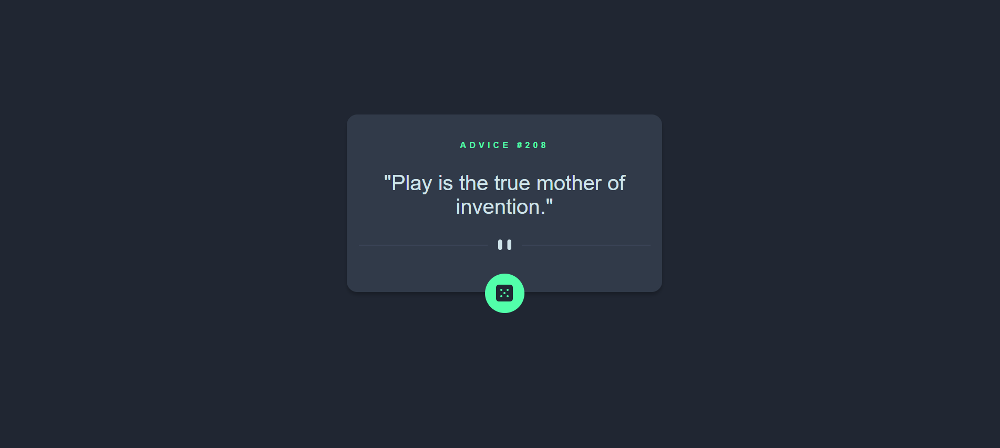
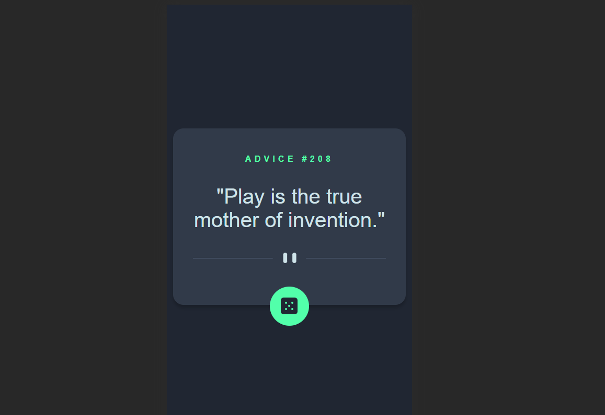

# Frontend Mentor - Advice generator app solution

This is a solution to the [Advice generator app challenge on Frontend Mentor](https://www.frontendmentor.io/challenges/advice-generator-app-QdUG-13db). Frontend Mentor challenges help you improve your coding skills by building realistic projects.

## Table of contents

- [Overview](#overview)
  - [The challenge](#the-challenge)
  - [Screenshot](#screenshot)
  - [Links](#links)
- [My process](#my-process)
  - [Built with](#built-with)
  - [What I learned](#what-i-learned)
  - [Continued development](#continued-development)
  - [Useful resources](#useful-resources)
- [Author](#author)
- [Acknowledgments](#acknowledgments)

## Overview

This project provides an advice from the API: https://api.adviceslip.com/ everytime you press the dice button. The fetching of the data was made with Fetch API from React using a mix of useState and useEffect. 

### The challenge

Users should be able to:

- View the optimal layout for the app depending on their device's screen size
- See hover states for all interactive elements on the page
- Generate a new piece of advice by clicking the dice icon

### Screenshot





### Links

- Solution URL: [Add solution URL here](https://github.com/javila26/advice-generator-react)
- Live Site URL: [Add live site URL here](https://advice-generator-react-ecru.vercel.app/)

## My process

### Built with

- Semantic HTML5 markup
- CSS custom properties
- Flexbox
- [React](https://reactjs.org/) - JS library

### What I learned

I used this small exercise to learn more about the use cases of the useEffect React hook. Although the same result could've been obtained by replacing it with a normal function, for this small project it didn't make the difference in the app performance and was a good environment to try it out.

```js
  useEffect(() => {
    fetch(API_ENDPOINT)
      .then((res) => res.json())
      .then((data) =>
        setAdvice({
          id: data.slip.id,
          advice: data.slip.advice,
        })
      );
  }, [generated]);
```

### Continued development

Is of my interest to continue putting in practice my knowledge of vainillia technologies like Html, Css and JS for developing applications, but at the same time starting to dig around the React framework and start to catch up with industry standards.

### Useful resources

- [React Dev](https://react.dev/learn/start-a-new-react-project) - Thanks to other's advice I know there's no better place to look for information about React than their official website.
- [W3Schools CSS](https://www.w3schools.com/css/) - Having always a bit code to mess with and make sure of understanding a property comes very handy.

## Author

- Website - [Jose Ávila](https://github.com/javila26)
- Frontend Mentor - [@javila26](https://www.frontendmentor.io/profile/javila26)

## Acknowledgments

Thanks to all the people who takes a little of their time to test my projects and give me some feedback. 
